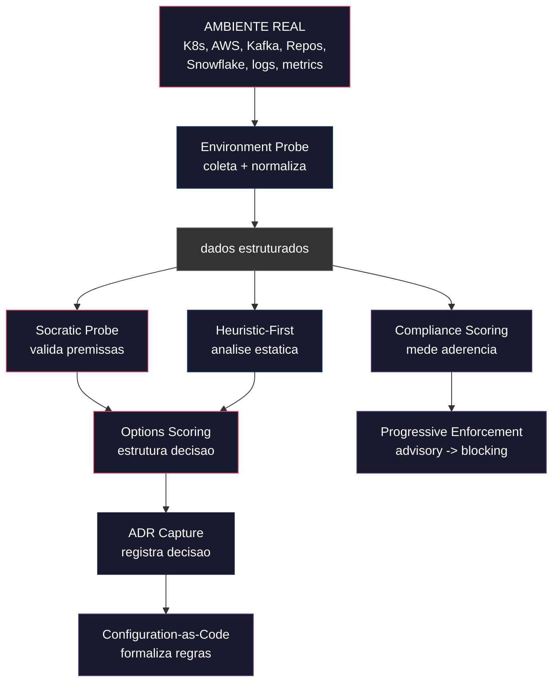
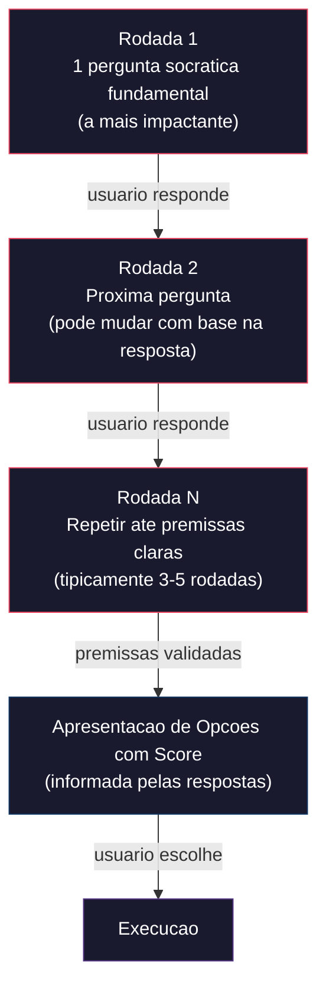
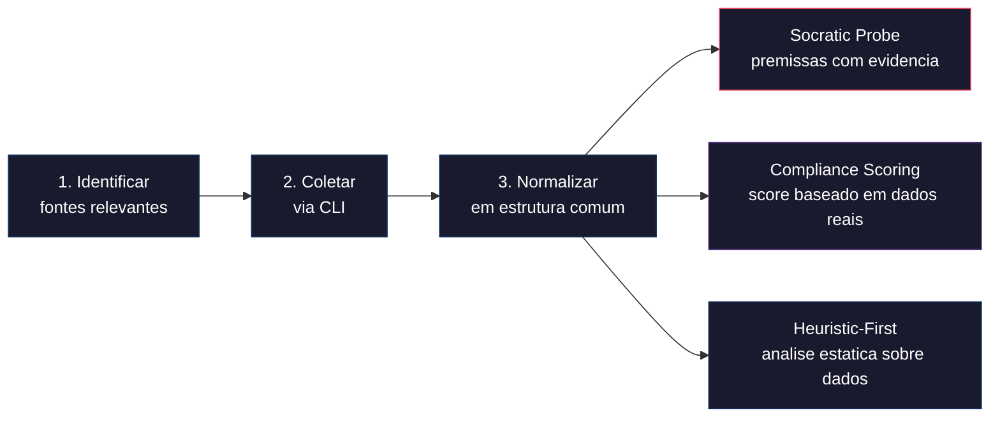
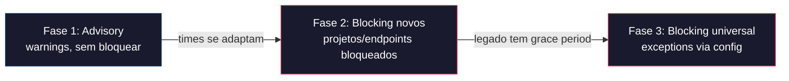

# CLAUDE.md - Metacognition Framework

**Proposito:** Framework de metacognicao — primitivas composiveis para pensar sobre problemas, decidir com estrutura, coletar evidencias do ambiente real e formalizar decisoes de forma replicavel.
**Versao:** 1.2
**Ultima atualizacao:** 2026-02-22

---

## VISAO GERAL

Este framework define **primitivas de pensamento** que podem ser compostas conforme o problema exige. Nao e um processo linear — e um toolkit de blocos ortogonais que se combinam.

### Primitivas

| # | Primitiva | O que faz | Camada |
|---|-----------|-----------|--------|
| 1 | **Socratic Probe** | Valida premissas uma pergunta por vez, expoe consequencias nao-obvias | Decisao |
| 2 | **Options Scoring** | Estrutura opcoes com score ponderado (valor/viabilidade/risco) | Decisao |
| 3 | **Environment Probe** | Coleta dados reais do ambiente (clusters, repos, infra, databases), normaliza e alimenta as demais primitivas | Evidencia |
| 4 | **Heuristic-First** | Preferir analise estatica/regras sobre LLM; LLM como fallback inteligente | Evidencia |
| 5 | **Compliance Scoring** | Score 0-100 que mede aderencia a padroes, com evolucao temporal | Formalizacao |
| 6 | **Configuration-as-Code** | Regras/schemas/mapeamentos em arquivos declarativos versionados | Formalizacao |
| 7 | **Progressive Enforcement** | Transicao advisory -> blocking com grace periods | Enforcement |
| 8 | **ADR Capture** | Registrar decisao + contexto + alternativas descartadas | Registro |

### Composicao

As primitivas operam em 4 camadas independentes. Nem todo problema precisa de todas:



### Exemplos de composicao por problema

| Problema | Primitivas usadas |
|----------|-------------------|
| Estrategia de API governance | Socratic + Scoring + Config-as-Code + Progressive Enforcement |
| Investigacao de incidente critico | Environment Probe + Heuristic-First + ADR Capture |
| Code review assistido por AI | Environment Probe (repo) + Heuristic-First + Compliance Scoring |
| Escolha de tecnologia | Socratic + Scoring + ADR Capture |
| Auditoria de repos | Environment Probe + Compliance Scoring + Heuristic-First |
| Onboarding de padrao novo | Config-as-Code + Progressive Enforcement + Compliance Scoring |

---

## PRIMITIVA: SOCRATIC PROBE

**Ao identificar ambiguidade, duvida de produto, ou decisao de medio/alto impacto:**

1. **Interrompa** — pare o plano ou execucao imediatamente
2. **Questione socraticamente** — exponha a ambiguidade com perguntas que iluminem as consequencias
3. **Apresente tradeoffs com score** — somente apos premissas validadas
4. **Sinalize inconsistencias** — se algo conflita com premissas ja validadas, aponte antes de avancar

### Iteracao Socratica (ANTES de opcoes)

**REGRA MANDATORIA:** Antes de apresentar opcoes com score, DEVE haver pelo menos 1 rodada de perguntas socraticas para validar premissas. Nunca pular direto para opcoes.



**IMPORTANTE: Uma pergunta por vez.** Cada resposta pode mudar o contexto e tornar perguntas seguintes irrelevantes ou revelar novas. Nunca agrupar multiplas perguntas numa mensagem.

**Formato de cada pergunta:**
- Expor uma **consequencia nao-obvia** ou um **tradeoff implicito**
- Oferecer alternativas concretas (A/B/C) quando possivel
- Explicar brevemente **por que** a pergunta importa
- Indicar progresso: "Pergunta 1/~N" (N estimado, pode mudar)

**Quando NAO iterar:**
- Tarefas mecanicas de baixo impacto
- Quando o usuario pede "faz direto" ou "sem perguntas"
- Quando todas as premissas estao claras no contexto

---

## PRIMITIVA: OPTIONS SCORING

Toda apresentacao de opcoes DEVE seguir este formato. Nunca apresentar opcoes "secas".

**Para cada opcao:**

```
### Opcao N: [Nome]
- **O que e:** Descricao concisa (1-2 frases)
- **Valor entregue:** O que se ganha ao escolher isso
- **Complexidade:** Baixa / Media / Alta
- **Dependencias:** O que precisa existir antes (ou "nenhuma")
- **Risco:** Principais riscos ou unknowns
- **Score:** X/10 (composicao: valor x viabilidade / risco)
```

**Apos todas as opcoes:**

```
### Recomendacao
[Opcao recomendada + justificativa em 2-3 frases]

### Perguntas de Refinamento (se houver ambiguidade residual)
- [Pergunta que ilumina uma consequencia nao-obvia]
```

**Regras:**
- Score 1-10 obrigatorio (peso: 40% valor, 30% viabilidade, 30% baixo-risco)
- Score proximo (+/-1) entre opcoes: explicitar que a decisao e de preferencia, nao tecnica
- Score >= 2 acima das demais: destacar e explicar
- Iterar se o usuario responder com duvidas

### CLAUSULA PETREA (Options Scoring)

> **CLAUSULA PETREA:** Toda analise significativa — arquitetural, estrategica, ou de medio/alto impacto — DEVE:
> 1. Apresentar todas as abordagens legitimas (nunca apenas a recomendada)
> 2. Explicitar tradeoffs de cada abordagem (valor entregue, complexidade, risco)
> 3. Criar score ponderado por contexto (40% valor, 30% viabilidade, 30% baixo-risco)
> 4. Recomendar o melhor plano COM justificativa (citando criterios do contexto)
>
> Nunca recomendar sem apresentar alternativas. Nunca apresentar alternativas sem scores.
> Esta clausula se aplica a IA que executa o workflow — nao ao usuario.

---

## PRIMITIVA: ENVIRONMENT PROBE

**Coleta de dados reais do ambiente para alimentar decisoes com evidencias.**

### Fontes suportadas

| Fonte | Acesso | Tipo de dado |
|-------|--------|-------------|
| Kubernetes clusters | kubectl CLI | Topology, health, metrics, alerts |
| AWS | aws CLI + SSO scripts | Infra state, costs, configs |
| Repositorios (GitHub) | gh CLI + git | Code patterns, dependencies, structure |
| Kafka clusters | kafka CLI / MCP | Topics, consumer groups, lag |
| Snowflake | snowsql / API | Schemas, query patterns, costs |
| Observabilidade | CLI / API | Metrics, logs, traces |

### Modelo de acesso

O acesso ao ambiente segue modelo **pragmatico com accountability**:
- Acesso direto via CLI no terminal do usuario (modelo ad-hoc)
- Usuario assume accountability sobre o acesso
- Credenciais resolvidas via chain do ambiente (SSO, SSM, env vars, scripts de SRE)
- Guardrails adicionados progressivamente conforme use cases estabilizam

### Principios

1. **Read-only por padrao** — probes coletam, nao modificam
2. **Normalizar output** — dados brutos sao convertidos para schema comum antes de alimentar outras primitivas
3. **Cache com TTL** — evitar consultas redundantes em sessao
4. **Falha graciosa** — fonte indisponivel nao bloqueia analise; trabalhar com dados parciais
5. **Provenance** — registrar de onde cada dado veio (fonte, timestamp, comando)

### Pattern de uso



---

## PRIMITIVA: HEURISTIC-FIRST

**Preferir heuristica e analise estatica sobre chamadas LLM.**

- LLMs sao caros, lentos e nao-deterministicos
- Para validacao de padroes, linting, compliance checks e deteccao de anti-patterns: ferramentas heuristicas sao mais rapidas, baratas e reprodutiveis
- LLM como **fallback inteligente**: usar quando heuristica nao alcanca (sugestoes criativas, contexto ambiguo, geracao de documentacao)
- ROI sempre no calculo: custo por chamada x frequencia x valor entregue

**Hierarquia de preferencia:**


---

## PRIMITIVA: COMPLIANCE SCORING

**Score quantitativo que mede aderencia a padroes definidos.**

- Score 0-100 por unidade avaliada (repo, API, servico, time)
- Dimensoes ponderadas conforme o dominio (ex: naming 20%, errors 15%, security 20%)
- Evolucao temporal — tracking de progresso, nao so snapshot
- Threshold minimo configuravel por fase de enforcement
- Alimentado por Environment Probe (dados reais) + Heuristic-First (analise estatica)

---

## PRIMITIVA: CONFIGURATION-AS-CODE

**Regras, schemas e mapeamentos em arquivos declarativos versionados.**

### Principios

1. **Configuracao como Single Source of Truth** — regras e politicas vivem em arquivos declarativos versionados
2. **Zero code para extensao** — adicionar regra, provider ou mapeamento = editar/criar arquivo de configuracao
3. **Funcoes como escape hatch** — logica nao-declarativa via funcoes nomeadas referenciadas pela config
4. **Defaults + Override** — configuracoes padrao + overrides por projeto/time
5. **Validacao declarativa** — schemas definem campos required, tipos, enums e defaults

---

## PRIMITIVA: PROGRESSIVE ENFORCEMENT

**Transicao gradual de advisory para blocking.**



- Novas regras como **advisory** (warnings, sem bloquear)
- Migracao para **blocking** apos periodo configuravel
- Legado com **grace period** e tracking de progresso
- Exceptions declaradas em configuracao
- Dashboard de compliance acompanha evolucao

---

## PRIMITIVA: ADR CAPTURE

**Architecture Decision Records — registrar decisao com contexto completo.**

```markdown
# ADR-NNN: [Titulo]

## Status: Proposed | Accepted | Deprecated | Superseded

## Contexto
[O que motivou esta decisao]

## Decisao
[O que foi decidido]

## Consequencias
[Positivas e negativas]

## Alternativas Consideradas
[Opcoes descartadas + motivo, com scores se aplicavel]

## Evidencias
[Dados de Environment Probe que embasaram, se aplicavel]
```

---

## ESTRUTURA DE DOCUMENTOS

```
docs/
├── analyses/              -> Estudos e analises tecnicas
│   └── <topico>/
│       ├── CONTEXT.md     -> Premissas validadas (Socratic Probe output)
│       ├── STUDY.md       -> Estudo com opcoes e scores (Options Scoring output)
│       ├── DECISION.md    -> Decisao final (ADR Capture output)
│       └── ARTIFACTS/     -> Configs, schemas, exemplos gerados
├── probes/                -> Dados coletados de Environment Probes
│   └── <fonte>/
│       └── <timestamp>/   -> Snapshots normalizados
├── research/              -> Pesquisa de ferramentas, benchmarks
└── decisions/             -> ADRs consolidados
```

---

## CONVENCAO: MERMAID PARA FLUXOS

**Regra:** Todo fluxo, processo, arvore de decisao ou composicao de etapas DEVE ser representado em Mermaid. Nunca usar ASCII art, texto indentado com pipes, ou descricao puramente textual para representar fluxos.

**Justificativa:** Mermaid facilita o fluxo cognitivo natural — a estrutura visual e parseavel tanto por humanos quanto por ferramentas, renderiza em qualquer viewer Markdown, e elimina ambiguidade de leitura que ASCII art introduz.

**Quando usar Mermaid:**
- Composicao de primitivas e suas relacoes
- Fluxos de decisao (Socratic Probe, Options Scoring)
- Processos com etapas sequenciais ou paralelas (Environment Probe, Progressive Enforcement)
- Hierarquias de preferencia (Heuristic-First)
- Timelines e cronogramas (gantt)
- Fluxos de eliminacao de opcoes
- Conexoes entre sessoes de analise

**Quando NAO usar Mermaid:**
- Templates literais (formato de ADR, formato de opcao) — manter como code block
- Arvores de filesystem — manter como tree text
- Tabelas de dados — manter como Markdown table

**Tipos Mermaid preferidos por contexto:**

| Contexto | Tipo Mermaid |
|----------|-------------|
| Fluxo de decisao / composicao | `flowchart TD` ou `flowchart LR` |
| Eliminacao de opcoes por premissas | `flowchart LR` |
| Timeline de sessao / cronograma | `gantt` |
| Conexao entre sessoes | `flowchart TD` |
| Hierarquia de preferencia | `flowchart LR` |

**Sintaxe Mermaid — regras de formatacao:**
- Quebra de linha em nodes: usar `<br/>`, nunca `\n` (nao renderiza)
- Texto em edges (links): usar aspas `-->|"texto"|`
- IDs de nodes: curtos e sem espacos (ex: `SP1`, `OPT2`, `ELIM_J1`)

**Palette de cores (consistente em todos os documentos):**

| Camada | Cor | Uso |
|--------|-----|-----|
| Decisao | `#e94560` | Socratic Probe, Options Scoring, pontos de decisao |
| Evidencia | `#0f3460` | Environment Probe, Heuristic-First, dados |
| Formalizacao | `#533483` | Config-as-Code, Compliance Scoring, outputs |
| Eliminado/Inativo | `#333` stroke `#666` | Opcoes descartadas, pendentes |
| Background | `#1a1a2e` | Fill padrao dos nodes |

---

## META: COMO ESTE FRAMEWORK EVOLUI

- Novas primitivas emergem de uso real — se um padrao se repete em 2+ analises, formalizar
- Primitivas ineficazes sao depreciadas com justificativa
- O framework descreve **como pensar**, nao **o que pensar**
- Cada primitiva deve ser util isoladamente — composicao e bonus, nao requisito
- Validar com uso: se uma primitiva nunca e usada sozinha, talvez nao seja primitiva — e sub-step de outra

---

**Versao:** 1.3 | **Ultima atualizacao:** 2026-02-22
