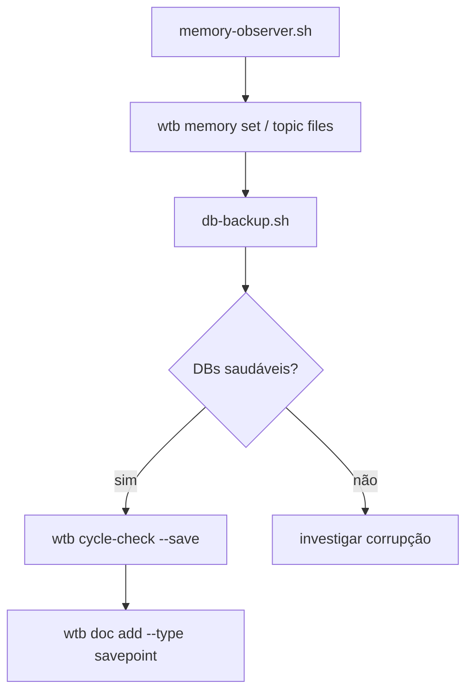

> 📍 [README](../../README.md) > Guides > Cycle Close

# Cycle Close — Session Exit

Procedimento para encerrar um ciclo de trabalho de forma estruturada.

## Comando principal

```bash
wtb cycle-check --save --repo <path>
```

## Sinais avaliados

| Sinal | Peso | Critério |
|-------|------|---------|
| `git_changes` | 2 | arquivos modificados desde HEAD |
| `tests_pass` | 3 | `go test ./...` passa |
| `build_pass` | 3 | binário compila |
| `time_elapsed` | 1 | ≥30min desde último savepoint |
| `packages_touched` | 1 | pacotes Go distintos modificados |

**Threshold:** 6/10 para savepoint automático.

## Ordem de execução (Session Exit Rule)



## Salvar savepoint

Savepoints vivem **exclusivamente no `docs.db`** — nunca como arquivos `.md` commitados.

```bash
# 1. Verificar estado
wtb cycle-check --repo ~/workflow

# 2. Gravar savepoint técnico (sinais, score)
wtb cycle-check --save --repo ~/workflow

# 3. Adicionar savepoint rico (narrativo) ao docs.db
wtb doc add --type savepoint --title "Savepoint YYYY-MM-DD — <contexto>" --date YYYY-MM-DD
```

Para consultar depois:

```bash
wtb doc list --type savepoint --since 2026-04-01
wtb doc get <id>
```

## Atualizar memória

```bash
# 1. Observar o que foi aprendido na sessão
bash ~/workflow/scripts/memory-observer.sh --repo <path> --hours 8

# 2. Para cada fato novo confirmado
wtb memory set <key> <valor> --type <threshold|config|fact> --topic <topic> --desc "..."
```

## Backup de DBs

```bash
bash ~/workflow/scripts/db-backup.sh
```

O script valida integridade de `docs.db` e `backlog.db` e cria backups datados. Se falhar, **não prosseguir** com o savepoint.
