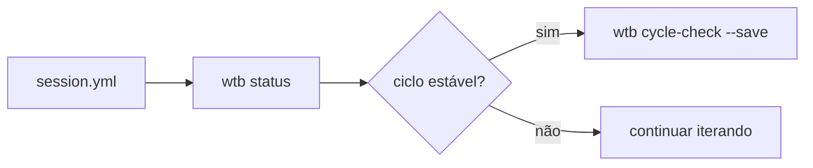

> 📍 [README](../../README.md) > Guides > Getting Started

# Getting Started — workflow-toolkit

## Instalação

```bash
cd ~/workflow && go build ./cmd/wtb/... -o ~/bin/wtb
```

## Primeiro uso

```bash
wtb status           # estado atual
wtb cycle-check      # avalia ciclo
wtb backlog list     # tarefas ativas
wtb doc list         # artefatos
```

## Fluxo básico



## Próximos passos

- [Ops Response](ops-response.md)
- [Cycle Close](cycle-close.md)
