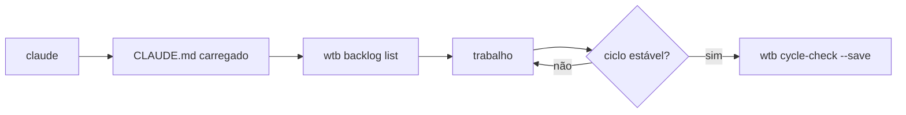

> 📍 [README](../../README.md) > Guides > Getting Started

# Getting Started — workflow-toolkit

## Instalação

```bash
# Clonar
git clone git@github.com:<seu-usuario>/workflow-starter ~/workflow
cd ~/workflow

# Compilar o wtb
go build -o ~/bin/wtb ./cmd/wtb

# Adicionar ~/bin ao PATH (se necessário)
echo 'export PATH="$HOME/bin:$PATH"' >> ~/.zshrc && source ~/.zshrc

# Configurar repo root
echo 'export WTB_REPO_ROOT="$HOME/workflow"' >> ~/.zshrc && source ~/.zshrc
```

## Registrar wtb como MCP global

```bash
./scripts/wtb-daemon-setup.sh
```

Isso inicia `wtb serve` via launchd e registra o MCP em `~/.claude/settings.json`.
Reinicie o Claude Code após rodar.

## Verificação

```bash
wtb status               # estado da plataforma
wtb repo status          # saúde do índice de repos
wtb doc list             # artefatos existentes
wtb backlog list         # tarefas ativas
```

## Iniciar sessão

```bash
cd ~/workflow
claude
```

O Claude lerá o `CLAUDE.md` automaticamente e terá acesso a todos os comandos `wtb` e às 40 tools MCP.

## Fluxo básico de sessão



## Próximos passos

- [wtb como MCP Global](wtb-mcp.md) — 40 tools disponíveis em qualquer repo
- [MCPs Recomendados](mcps.md) — GitHub, Datadog, Slack, etc.
- [Cycle Close](cycle-close.md) — como encerrar uma sessão corretamente
- [Memory System](memory-system.md) — como armazenar conhecimento operacional
