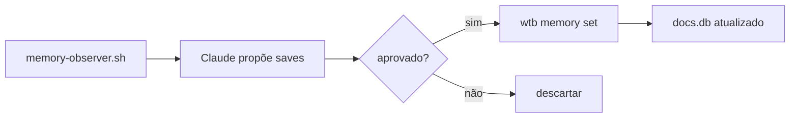

> 📍 [README](../../README.md) > Guides > Memory System

# Memory System

Sistema de memória persistente entre sessões via `wtb memory` e topic files.

## Componentes

| Componente | Formato | Conteúdo |
|------------|---------|----------|
| `docs.db` (type=config) | SQLite | Fatos key-value (thresholds, IDs, configs) |
| `.claude/memory/*.md` | Markdown | Topic files com contexto rico |
| `~/.claude/projects/.../memory/MEMORY.md` | Markdown | Índice de topic files (auto-memory Claude Code) |

## Comandos

```bash
wtb memory set <key> "<val>" --type threshold --topic webhook --desc "..."
wtb memory get <topic>
wtb memory list [--topic <t>]
wtb memory list --stale 60         # entradas não verificadas em 60+ dias
wtb memory where "<descrição>"     # roteamento automático
wtb memory validate                # guardrails de bloat
wtb memory migrate                 # importa context.json legado → docs.db
```

## Fluxo de captura (Session Exit)



## Tipos de entrada

- `threshold` — limite numérico calibrado empiricamente
- `config` — ID de conexão, endpoint, parâmetro de infra
- `fact` — fato operacional confirmado
- `limit` — limite de recurso (memória, CPU, réplicas)
