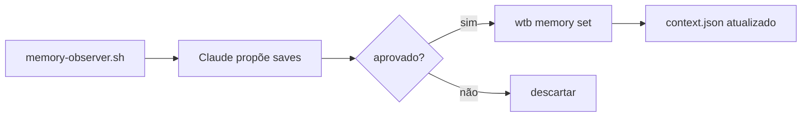

> 📍 [README](../../README.md) > Guides > Memory System

# Memory System

Sistema de memória persistente entre sessões via `wtb memory` e topic files.

## Componentes

| Componente | Formato | Conteúdo |
|------------|---------|----------|
| `context.json` | JSON | Fatos key-value (thresholds, IDs, configs) |
| `memory/*.md` | Markdown | Topic files com contexto rico |
| `MEMORY.md` | Markdown | Índice de topic files |

## Comandos

```bash
wtb memory set <key> "<val>" --type threshold --topic webhook --desc "..."
wtb memory get <topic>
wtb memory list [--topic <t>]
wtb memory where "<descrição>"   # roteamento automático
wtb memory validate              # guardrails de bloat
```

## Fluxo de captura (Session Exit)



## Tipos de memória

- `threshold` — limite numérico calibrado empiricamente
- `config` — ID de conexão, endpoint, parâmetro de infra
- `fact` — fato operacional confirmado
- `rule` — regra de processo (vai para MEMORY.md)
