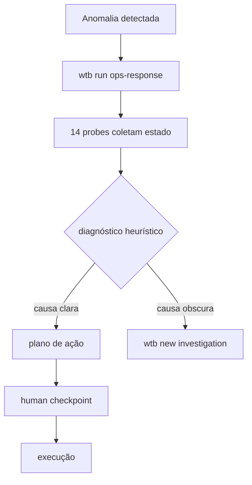

> 📍 [README](../../README.md) > Guides > Ops Response

# Ops Response

Workflow de resposta a incidentes via probes determinísticos (zero LLM).

## Trigger

```bash
wtb run ops-response
```

## Probes disponíveis

```bash
wtb ops db-health --namespace org
wtb ops k8s-status --namespace org
wtb ops kafka-status
wtb ops logs-analyze --window 10m
```

## Fluxo



## Handoff

- Causa raiz não clara → `wtb new investigation`
- Incidente encerrado → `wtb doc add --type postmortem`
